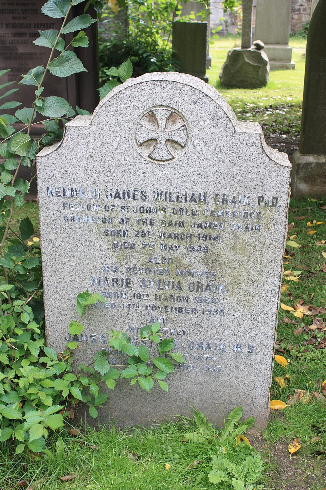

## The concept is older than everyone claiming credit. The dispute tells you more than the history.

In April 2026, Yann LeCun responded on LinkedIn to a charge that he had failed to credit Juergen Schmidhuber for foundational world-models work during a lecture at Brown University. His response was blunt: "I did not 'invent' world models, and neither did Juergen." He attributed the lineage to optimal control theorists in the late 1950s and early 1960s, compiled in the 1975 Bryson and Ho textbook. He cited Nguyen and Widrow's 1990 IJCNN paper on differentiable neural networks for control as preceding Schmidhuber's own work. And he closed with a line that is either a mic drop or a provocation, depending on who you ask:

> "Ideas are a dime a dozen. Showing how to make them work is what really matters."

Schmidhuber's position, laid out in a March 2026 IDSIA technical note titled "Who invented JEPA?", is more specific than "I invented world models." He claims three things. First, that his February 1990 technical report FKI-126-90, "Making the World Differentiable," was the first paper to use the term "world model" for a predictor neural network. Second, that LeCun's 2022 Joint-Embedding Predictive Architecture is "essentially identical" to Schmidhuber and Prelinger's 1992 Predictability Maximization system. Third, that LeCun's 2022 position paper "rehashes but does not cite essential work of 1990-2015."

The most interesting moment in this dispute is not the April 2026 LinkedIn exchange. It is a July 2022 exchange on OpenReview, almost four years earlier, where Schmidhuber posted essentially the same critique and LeCun responded directly:

> "I don't want to get into a sterile dispute about who invented by plowing through the 160 references listed in your response piece... As I say at the beginning of the paper, there are many concepts that have been around for a long time that neither you nor I invented: the concept of differentiable world model goes back to early work in optimal control. Trainable world models is the whole idea of systems identification. Using neural nets to learn world models goes back to the late 1980s with work by Michael Jordan, Bernie Widrow, Robinson and Fallside, Kumpathi Narendra, Paul Werbos, all predating your own work."

This exchange matters because it establishes the consensus root. Both sides agree: the world-models concept is much older than either of them. Optimal control formalized it in the 1950s and 1960s. Jordan, Widrow, and Werbos applied it to neural networks in the late 1980s, before Schmidhuber. What they disagree about is the 1990s onward: who gets credit for the specific deep-learning-shaped framework, and what counts as a contribution.

To understand why two of the most influential figures in deep learning are still arguing about credit eighty years after the underlying idea was first written down, you have to start with the philosophical hypothesis they both agree they did not invent.

## The 1943 Hypothesis

> "If the organism carries a 'small-scale model' of external reality and of its own possible actions within its head, it is able to try out various alternatives, conclude which is the best of them, react to future situations before they arise, utilise the knowledge of past events in dealing with the present and future, and in every way to react in a much fuller, safer, and more competent manner to the emergencies which face it."

Kenneth Craik, M.A. Edinburgh, Ph.D. Cambridge, Fellow of St. John's College. Page 61, Chapter 5 of *The Nature of Explanation*, published by Cambridge University Press in 1943. His only book. 130 pages. He wrote it three years before the first stored-program computer ran. Two years after publication, he was hit by a car while cycling through Cambridge and died at 31.

Both LeCun and Schmidhuber cite this passage. LeCun's 2022 paper opens Section 2.1 with: "The idea that humans, animals, and intelligent systems use world models goes back a long time in psychology (Craik, 1943)." Schmidhuber's "Who invented JEPA?" note cites the Craik reprint in its references. They agree on the 1943 origin even when they disagree on everything else.

Every clause maps to a modern world-model capability: small-scale model to learned latent dynamics, try out alternatives to CEM and MCTS, react to future situations to model-predictive control, calculating machine paralleling strains in a bridge to simulation as approximation. Craik wrote the architectural template in one paragraph, in 1943.

## Two Parallel Tracks Before the Neural Era

Craik's hypothesis was philosophical. Two unrelated traditions spent the next forty-five years validating it without building software.

In 1948, Edward Tolman published "Cognitive Maps in Rats and Men" in *Psychological Review*. The dominant frame was stimulus-response behaviorism: animals as telephone switchboards. Tolman's experiments showed rats building internal spatial representations, taking shortcuts they had never traversed, exploring dead ends vicariously before committing. This was the experimental case for what Craik had proposed five years earlier.

In 1969, Arthur Bryson and Yu-Chi Ho published *Applied Optimal Control*, the canonical reference for trajectory optimization with forward models. Pontryagin's minimum principle, the Hamilton-Jacobi-Bellman equation, gradient methods on action sequences. This is where model-predictive control got its modern form. LeCun's 2022 paper cites it directly.

Before Schmidhuber, before Nguyen and Widrow, late-1980s researchers were already applying neural networks to learn world models for control. Paul Werbos on neural-network forward models. Michael Jordan on the distal teacher framework. K. S. Narendra on adaptive control with neural networks. Bernie Widrow's adaptive systems lineage going back to the 1960s. LeCun explicitly named all of these in his 2022 reply to Schmidhuber as predating both of their work. Schmidhuber does not dispute this.

By 1990, the field knew the idea was right. What it did not know was how to make it work with the compute available. Two groups tried, took different paths, and both saw their proposals go mostly dormant for 25 years.

## The Two Neural Tracks of 1990-1992

Between 1990 and 1992, two distinct deep-learning-shaped attempts at world models emerged. Each took a different path. Both went mostly dormant for 25 years. Both came back almost simultaneously between 2018 and 2020. Modern model-based RL is a recombination of the two.

**Track A: Schmidhuber's RNN world models.** Juergen Schmidhuber, then at the Technical University of Munich, published a series of papers in 1990-1991 proposing recurrent neural networks as world models. Technical Report FKI-126-90, "Making the World Differentiable," appeared in February 1990. The framework: a controller RNN plus a world model RNN, where the controller plans through "mental experiments" (rollouts) using the world model. He also developed an artificial-curiosity framework for intrinsic motivation. Schmidhuber claims this was the first paper to use the term "world model" for a predictor neural network.

In 1992, Schmidhuber and Daniel Prelinger published "Discovering Predictable Classifications," a paper that matters for a later section of this article. The architecture: two non-generative networks where each network's latent representation tries to be both informative about its own input and predictable from the other network's latent representation. This is the paper Schmidhuber claims is "essentially identical" to JEPA.

**Track B: gradient-through-learned-dynamics.** Nguyen and Widrow at Stanford published in *IEEE Control Systems Magazine* in April 1990 the truck backer-upper demo: a two-network recipe where you train an emulator to predict next state, then train a controller via backpropagation through the emulator. LeCun cites this paper in both his 2026 LinkedIn post and his 2022 OpenReview reply. In 1992, Michael Jordan and David Rumelhart generalized this into the "distal supervised learning" framework, introducing the vocabulary of distal versus proximal goals and forward models.

The asymmetry in the credit dispute is this: LeCun acknowledges the Track B lineage (Werbos, Jordan, Widrow, Narendra) explicitly. Schmidhuber's Track A proposals were RL-style with rollout planning, a different recipe from the emulator-controller-backprop pattern. The modern Dreamer line descends more directly from Track B. The modern JEPA line traces more directly to LeCun's own 2022 framing. But Schmidhuber's 1992 PMAX paper is the specific case where his framework anticipated something modern in a non-trivial way.

Both tracks went dormant for the same reasons. 1990s CPUs could not train both an emulator and a controller with backpropagation through time at any meaningful scale. Vanishing and exploding gradients made long-horizon planning unstable. And the reinforcement-learning community took a different path entirely: Q-learning, TD methods, REINFORCE. RL methods did not need a forward model.

## The 2018-2020 Reconstruction Era

By the time deep learning made the original ideas tractable, both tracks had been mostly forgotten. When the field rediscovered them in 2018-2020, it rediscovered them as two separate things, and reconstructed pixels in both cases.

**Ha and Schmidhuber (2018)** revived Track A. A variational autoencoder compresses frames into latents, an LSTM predicts next latents plus reward, a tiny controller trained with CMA-ES. The headline trick: train the controller entirely inside the model's hallucinated dream.

**PlaNet** (Hafner et al., 2019) introduced the Recurrent State-Space Model and planned in latent space with Cross-Entropy Method. Still trained with pixel reconstruction in the variational objective.

**Dreamer** (Hafner et al., 2020) revived Track B in modern form: actor-critic via backpropagation through learned dynamics. Still pixel reconstruction for representation training.

**MuZero** (Schrittwieser et al., 2020) was the partial exception. DeepMind's MCTS-plus-learned-model combination achieved superhuman Go, Chess, and Shogi without being told the rules. It predicts only policy, value, and reward, never observations. But MuZero was built specifically for discrete-action games and did not extend to continuous control.

The case against pixel reconstruction is straightforward. A 224x224 RGB frame has 150,528 numbers. A planner cares about maybe 10-20 of them. Training a model to reconstruct all of them spends huge capacity on irrelevant detail. When multiple futures are plausible, a pixel regressor under MSE loss outputs the average of the plausible futures: a blurry image that never actually happens.

By 2020, both 1990s tracks had been recreated with deep learning, but the architectural commitment to pixel reconstruction was nearly universal.

Then, in mid-2022, LeCun published a 62-page document arguing for a different approach. Schmidhuber wrote a critique within weeks. The argument that started in July 2022 is the one that resurfaced on LinkedIn this April.

## The JEPA Argument (2022)

LeCun's paper, "A Path Towards Autonomous Machine Intelligence," described it himself in the prologue:

> "This document is not a technical nor scholarly paper in the traditional sense, but a position paper expressing my vision for a path towards intelligent machines that learn more like animals and humans, that can reason and plan, and whose behavior is driven by intrinsic objectives, rather than by hard-wired programs, external supervision, or external rewards."

The technical heart introduces Joint-Embedding Predictive Architecture, JEPA. Two encoders: one for input x, one for target y. A predictor that maps x's embedding to y's embedding. No decoder back to pixel space. Loss computed in latent space, not pixel space. The argument: representation learning should not require reconstruction. It should require prediction, predicting one set of features from another.

Schmidhuber read the JEPA proposal and immediately recognized it as something he had published in 1992.

## Predictability Maximization vs. JEPA

In his 2026 technical note, Schmidhuber argues that JEPA is "essentially identical to our 1992 Predictability Maximization system." His description of PMAX:

> "Two non-generative artificial neural networks interact as follows: one net tries to create a non-trivial, informative, latent representation of its own input that is predictable from the latent representation of the other net's input."

Compare to LeCun's 2022 description of JEPA:

> "JEPAs learn to predict the embeddings of a signal y from a compatible signal x, using a predictor network that is conditioned on additional (possibly latent) variables z to facilitate prediction."

Read literally, these descriptions describe the same architectural pattern. Two networks, each with its own latent space, coupled by a prediction objective in latent space, with regularization to prevent collapse. The 1992 PMAX paper even explicitly addresses collapse prevention.

What is different?

Scale. PMAX (1992) was tested on a stereo vision task with very small networks. I-JEPA (2023) trains a ViT-Huge on ImageNet using 16 A100 GPUs. The implementations differ by roughly four orders of magnitude in compute.

Anti-collapse mechanism. PMAX used Predictability Minimization as a sub-module. I-JEPA uses EMA plus stop-gradient. LeJEPA (2025) uses SIGReg. Three different non-trivial mechanisms, same goal.

Application. PMAX was framed as discovering "predictable classifications," a representation-learning method. JEPA is framed as a step toward autonomous machine intelligence, an architectural foundation. Same algorithm, different framing.

Schmidhuber is right that the architectural pattern of JEPA was published by him in 1992. He is also right that LeCun's 2022 paper presents this pattern as the core idea without citing PMAX. The subsequent JEPA-family papers, I-JEPA, V-JEPA, LeJEPA, LeWM, also do not cite it. That is a consistent omission across the entire literature.

LeCun is right that 1992 PMAX was not deep-learning-scale and did not catalyze a research program. Schmidhuber's group did not continue developing PMAX into a controller for embodied agents, which is what LeWM in 2026 finally does.

Both can be true. Schmidhuber published the architectural template in 1992 and did not get cited. LeCun took the same template, scaled it via modern compute, and built a research program around it. Whether that constitutes "rehashing" or "realizing" is partly a values question. Different people can read the same evidence and come to different conclusions about what counts as a contribution.

## The Realization (2023-2026)

The chain of papers that made JEPA work end-to-end. None cite Schmidhuber's 1992 PMAX.

**I-JEPA** (Assran et al., January 2023). Predict the embeddings of masked image blocks from a context block. Anti-collapse via EMA plus stop-gradient. ViT-Huge/14 trained on ImageNet in under 72 hours on 16 A100s. Beat MAE on linear probing without hand-crafted augmentations. No PMAX citation.

**V-JEPA** (Meta, April 2024). Same recipe extended to video with spatiotemporal masking. No PMAX citation.

**LeJEPA** (Balestriero and LeCun, November 2025). Replaced the EMA bag of tricks with SIGReg, a Sketched Isotropic Gaussian Regularizer. By the Cramer-Wold theorem, a multivariate distribution is Gaussian if and only if every 1-D projection is Gaussian. Project the batch onto roughly 1000 random unit directions, test each against the standard Gaussian's characteristic function, sum the squared mismatches. Provable anti-collapse, one tunable hyperparameter, no EMA. The unlock that removed the ad hoc tricks JEPA training had relied on. No PMAX citation.

**LeWorldModel** (Maes et al., March 2026). The first action-conditioned end-to-end JEPA. ViT-tiny encoder (5M parameters) plus causal transformer predictor (10M parameters) with AdaLN-zero action conditioning. Training: prediction MSE in latent space plus SIGReg. Two loss terms. No reward. No decoder. No pixel reconstruction. Roughly 15M total parameters, single-GPU training in hours, 48 times faster planning than DINO-WM on Push-T at comparable accuracy. No PMAX citation.

LeWM is the first system that fuses both 1990s tracks (latent dynamics plus gradient-through-model) with the JEPA pivot (no reconstruction). Whether you describe that pivot as a new idea or a rebranding of 1992 work depends on what you read.

## What's Still Missing

The story has a clean ending: Craik's hypothesis becomes engineering reality. Except we are still missing most of what Craik, and LeCun, actually wanted.

Hierarchical planning is not solved. LeWM plans five high-level steps, roughly 25 environment ticks at 12 Hz. That is about two seconds. LeCun's 2022 paper explicitly proposed Hierarchical JEPA. It has not been built.

Intrinsic motivation is unrealized. LeCun's vision was agents driven by intrinsic objectives: curiosity, novelty, learning progress. LeWM uses goal images as the cost signal. That is a degenerate single-step reward function in disguise. Real intrinsic motivation modules, the Schmidhuber 1990s curiosity line, have not been integrated into the modern JEPA stack.

The generative-video competitors are betting differently. OpenAI's Sora, DeepMind's Genie, NVIDIA's Cosmos, Wayve's GAIA-1: foundation-scale video models proposed as "world simulators." They make the opposite architectural bet. Predict pixels, scale up, hope emergent capability solves planning. Whose bet pays off is genuinely unsettled in 2026.

JEPA wins decisively in the lane it competes in: compact latent control with fast planning on visually moderate scenes. On visually rich 3D scenes, DINO-WM still beats LeWM. On long-horizon strategy, nobody wins yet.

## The Eighty-Year Arc

The argument between LeCun and Schmidhuber is, fundamentally, about what counts as a contribution to the field.

Schmidhuber's view: writing down the architectural pattern is the contribution. If LeCun proposes JEPA in 2022 and it is the same architecture as PMAX 1992, Schmidhuber should be cited. The fact that PMAX did not run at modern scale does not change who had the idea.

LeCun's view: ideas are abundant. Making them work at scale is rare. If JEPA succeeds where PMAX did not, the success is the contribution, not the architectural template.

Both are partly right. This is a real dispute about scientific values, not a technical argument that can be settled by checking the math.

The world-models concept itself is older than either of them. Bryson and Ho 1969 has the math. Werbos, Jordan, Widrow, Nguyen, Narendra applied it to neural networks before either Schmidhuber or LeCun. The 1990s neural-network revival is a footnote in a much longer story that runs back to 1943.

The eighty-year arc is not the story of who invented what. It is the story of why an idea written down in 1943, that agents need internal models of external reality to plan effectively, took eighty years to start working as software. The answer is mundane: compute, regularization techniques, attention mechanisms, careful initialization, gradient clipping, layer normalization. The kind of engineering that does not show up in priority disputes.

Both LeCun and Schmidhuber, decades into their careers, are arguing about who should be credited with the 1990s realization of an idea Craik finished proposing while Einstein, with twelve years of life still ahead of him, was searching for a unified field theory he would never find.

Craik died in 1945. He never saw the first computer run, never saw a neural network, never saw a single one of the ideas he sketched in Chapter 5 turned into working code. *The Nature of Explanation* contains essentially his complete intellectual output. Tragically, he was knocked off his bicycle in Cambridge and so died, at the age of 31.

Eighty years after Kenneth Craik wrote it down, machines now actually do this: in compact 192-dimensional latent spaces, on a single GPU, in a few hours of training. The small-scale model is real. The argument about who deserves credit will outlive everyone currently making it. The remaining hard parts of what Craik described, "try out alternatives," "react to future situations," "utilise the knowledge of past events," are mostly still ahead of us. By the time those work, someone new will be arguing about who invented them too.

---

**References**

1. Craik, K. J. W. (1943). *The Nature of Explanation*. Cambridge University Press.
2. Tolman, E. C. (1948). "Cognitive Maps in Rats and Men." *Psychological Review* 55(4): 189-208.
3. Bryson, A. E. & Ho, Y.-C. (1969/1975). *Applied Optimal Control*.
4. Nguyen, D. H. & Widrow, B. (1990). "Neural Networks for Self-Learning Control Systems." *IEEE Control Systems Magazine*, April 1990.
5. Schmidhuber, J. (1990). "Making the World Differentiable." TR FKI-126-90, TUM.
6. Jordan, M. I. & Rumelhart, D. E. (1992). "Forward Models: Supervised Learning with a Distal Teacher." *Cognitive Science* 16, 307-354.
7. Schmidhuber, J. & Prelinger, D. (1993). "Discovering Predictable Classifications." *Neural Computation* 5(4):625-635.
8. Ha, D. & Schmidhuber, J. (2018). "World Models." arxiv:1803.10122.
9. Hafner, D. et al. (2019). "Learning Latent Dynamics for Planning from Pixels." ICML 2019.
10. Hafner, D. et al. (2020). "Dream to Control: Learning Behaviors by Latent Imagination." ICLR 2020.
11. Schrittwieser, J. et al. (2020). "Mastering Atari, Go, Chess and Shogi by Planning with a Learned Model." arxiv:1911.08265.
12. LeCun, Y. (2022). "A Path Towards Autonomous Machine Intelligence." OpenReview.
13. Schmidhuber, J. (2022). "LeCun's 2022 paper rehashes but does not cite essential work of 1990-2015." people.idsia.ch/~juergen/lecun-rehash-1990-2022.html
14. Schmidhuber, J. (2026). "Who invented 'JEPA'?" Technical Note, IDSIA.
15. Maes, L. et al. (2026). "LeWorldModel." arxiv:2603.19312.
