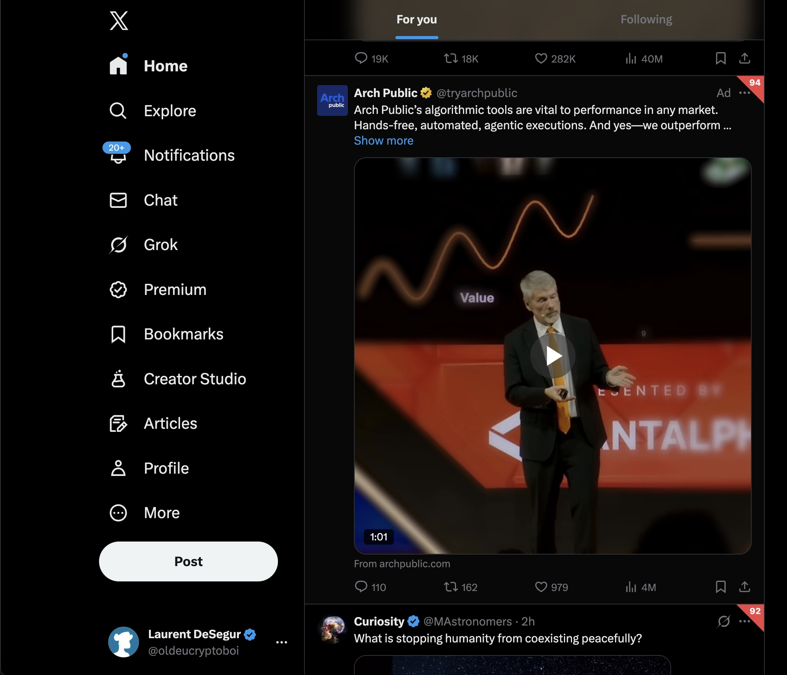

## Dog-ear badges, a sensitivity curve that actually makes sense, and the leap from LinkedIn to X

When I [shipped LAID](/blog/laid-detecting-ai-on-linkedin/) a few weeks ago, it did one thing: detect AI-generated LinkedIn posts. It worked. But LinkedIn isn't the only platform drowning in synthetic text.

Twitter — sorry, X — has the same problem, just compressed into 280 characters. The tells are subtler. The posts are shorter. The DOM is a nightmare. So I spent a day rebuilding the extension to handle both platforms, and fixed a bunch of things that were bothering me along the way.

The result is **X/LAID v1.1** — same 14-signal heuristic pipeline, now running on two platforms, with a better UI and a sensitivity system that isn't held together with duct tape.

---

### Crossing platforms

The detection pipeline didn't need to change — the same 14 analyzers work on any English text. What changed is everything around it: how we find posts in the DOM, what counts as "enough text to analyze," and what the AI prompt says.

On LinkedIn, posts live in predictable containers. On X, tweets live inside `article[data-testid="tweet"]` elements, with the actual text buried in `[data-testid="tweetText"]`. Platform detection happens by hostname — `x.com` and `twitter.com` route through the same pipeline with different selectors.

The bigger design decision was the minimum text threshold. LinkedIn posts tend to be long — 100 characters is a reasonable floor. Tweets are short by nature. Setting the same threshold would skip half the feed. So tweets get a 50-character minimum. It's a trade-off: shorter text means less signal for the heuristics, but ignoring most tweets defeats the purpose.

The LLM prompt also adapts. When analyzing a tweet, it says "tweet" instead of "LinkedIn post" — small detail, but it changes how the model weighs platform-specific conventions.

---

### LinkedIn comments, too

While I was mapping DOM selectors, I added comment detection on LinkedIn. Comments load dynamically as you scroll, so the existing `MutationObserver` already catches them. I just needed the selectors (`.comments-comment-item`, `.comments-comment-entity`) and the same 50-character minimum threshold used for tweets.

Comments are interesting because they're where people are least likely to be careful with AI. A post might get a human edit pass, but a comment generated by an AI assistant often ships as-is.

---

### The dog-ear

The original LAID badge was a circle overlaid on the post. It worked conceptually but kept colliding with Follow buttons, "..." menus, and other UI elements. Every platform update risked breaking the positioning.

The fix: a corner-fold triangle at the top-right of each post, using `clip-path: polygon`. It looks like a turned-down page corner — hence "dog-ear." It sits in dead space that no platform uses for interactive elements, so there's nothing to collide with.

The hover animation scales from the corner (`transform-origin: top right`), and the loading spinner sits inside the triangle while analysis runs. Small touch, but it eliminated the entire class of overlap bugs.

---

### Sensitivity done right

The original sensitivity slider was a linear bias: ±15% on top of the raw score. It sort of worked, but the mapping was unintuitive. What does "+10% sensitivity" actually mean?

The new system uses a blend-to-extremes curve:

- **Slider at 0** → all scores collapse to 0. Everything reads as human.
- **Slider at 50** → scores pass through unchanged. Neutral.
- **Slider at 100** → all scores collapse to 1. Everything reads as AI.

The slider track itself is a green-to-red gradient with a center notch labeled "Neutral," so the mental model is immediately obvious. You're not tweaking a coefficient — you're deciding how skeptical you want to be.

Under the hood, I also had to fix a Chrome sync storage issue. The old slider wrote to `chrome.storage.sync` on every input event, which would blow past Chrome's write quota during fast drags. The fix is a 150ms debounce. On sensitivity change, `clearAndRescan()` wipes existing badges and re-runs the pipeline so results reflect the new setting immediately.

---

### Popup branding

The extension now detects which platform you're on and adjusts accordingly. On LinkedIn, the popup shows **LAID** with the subtitle "LinkedIn AI Detector." On X, it shows **XAID** — "X AI Detector." The extension's manifest name is now **X/LAID — AI Detector**, version 1.1.0.

It's cosmetic, but it matters for the three seconds between clicking the icon and understanding what you're looking at.

---

### What's next

The heuristic pipeline is platform-agnostic by design. Reddit, Hacker News, Bluesky — anywhere there's a DOM and enough text, the same 14 signals apply. The only work is writing selectors and tuning thresholds.

But the more interesting direction is the sensitivity curve. Right now it's a global bias. A per-signal sensitivity — letting users decide which heuristics to trust — would be more powerful and more honest about the uncertainty in any individual signal.

For now: install [X/LAID from GitHub](https://github.com/oldeucryptoboi/linkedin-ai-detector), scroll your X feed, and see what lights up.
